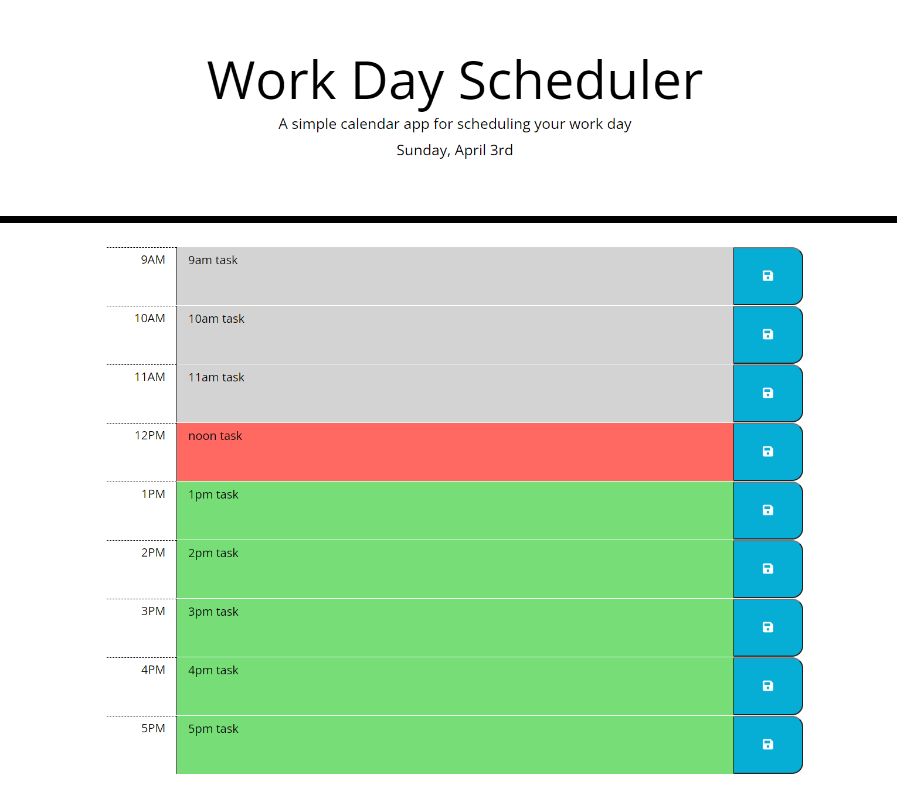

# Module 5 Challenge - Workday Scheduler

## This app has the following functionality
- the current day/date is displayed below the heading
- displays time blocks from 9am to 5pm
- time blocks are color coded based on the current time, grey for past, red for present, green for future
- the color of the time blocks will change based on the current time while the page is open
- the user can enter an event for each time block
- when the save button is clicked, the event in the time block is saved to local storage
- the saved events in local storage will be displayed on loading the page
- saved events can be deleted by saving the timeblock as empty

---
[Deployment Link](https://agoetz4407.github.io/workday-scheduler/)

---

